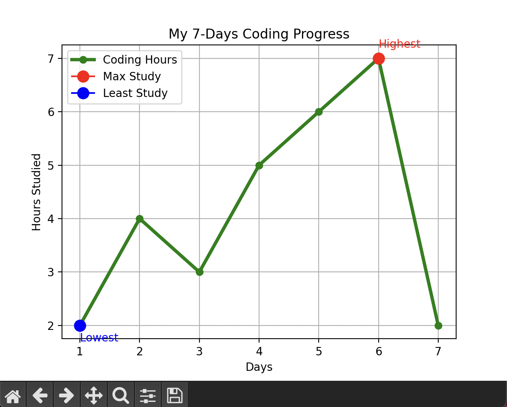

# 📊 Learning Progress Tracker

A Python project to track and visualize coding consistency using Matplotlib.

## 🚀 Features
- Tracks daily coding hours
- Highlights highest and lowest study days
- Visualizes data using a line plot
- Provides insights on consistency

## 🛠️ Technologies Used
- Python
- Matplotlib

## 📸 Output

## 📈 Key Insight
This project helps identify productivity patterns and improve consistency over time.

---

💡 Built as part of my Day 5/30 Data Science Journey
